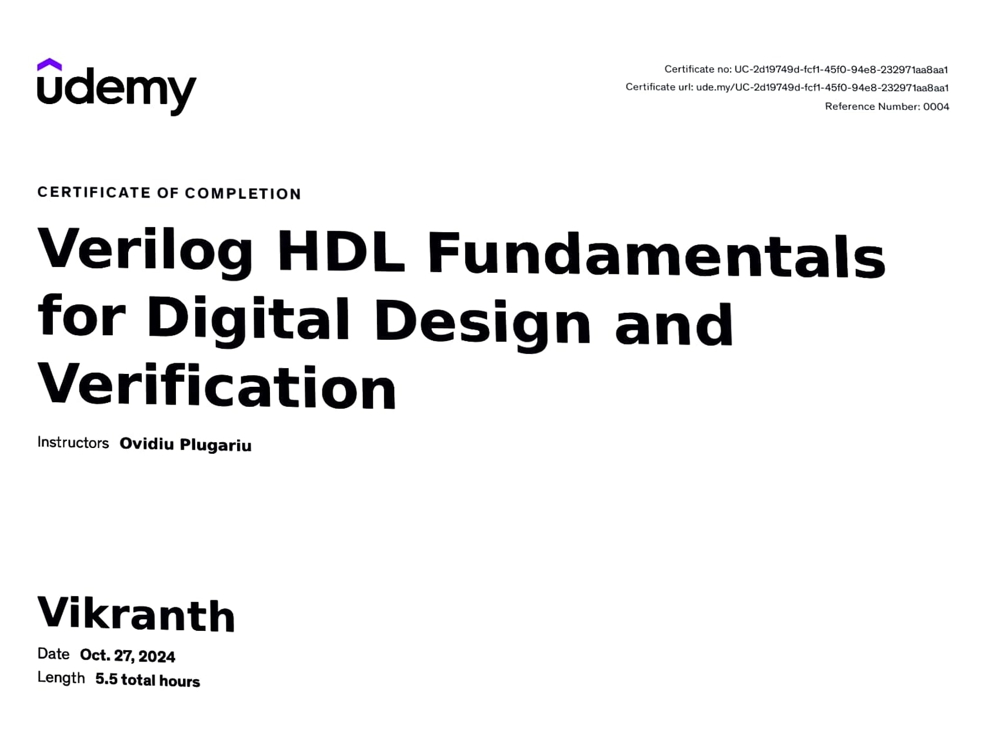

# 📜 Certificate Upload Guide

Follow these steps to add your certificates to your portfolio.

---

## 📁 STEP 1: Prepare Your Certificate Files

### File Requirements:
- **Format**: JPG, PNG, or PDF (if PDF, convert to image first)
- **Recommended Size**: 1200x800 pixels or similar aspect ratio
- **File Size**: Under 500KB for fast loading (compress if needed)
- **Quality**: Clear, readable text on the certificate

### Naming Convention:
Rename your certificate files to:
- `certificate-1.jpg` (or .png)
- `certificate-2.jpg`
- `certificate-3.jpg`
- `certificate-4.jpg`
- `certificate-5.jpg`

**Important**: Use exactly these names with the numbers matching the order you want them displayed.

---

## 📂 STEP 2: Create Certificates Folder

1. Open File Explorer
2. Navigate to: `C:\Users\aishw\OneDrive\Desktop\Git Port\assets\images`
3. Inside the `images` folder, create a new folder called **`certificates`**
4. Your path should now be: `C:\Users\aishw\OneDrive\Desktop\Git Port\assets\images\certificates`

---

## 📤 STEP 3: Upload Your Certificate Images

1. Copy all your renamed certificate files (certificate-1.jpg through certificate-5.jpg)
2. Paste them into: `C:\Users\aishw\OneDrive\Desktop\Git Port\assets\images\certificates`

Your folder structure should look like:
```
Git Port/
├── assets/
│   └── images/
│       ├── certificates/          ← New folder
│       │   ├── certificate-1.jpg
│       │   ├── certificate-2.jpg
│       │   ├── certificate-3.jpg
│       │   ├── certificate-4.jpg
│       │   └── certificate-5.jpg
│       ├── hardware-project1.jpg
│       ├── hardware-project2.jpg
│       └── hardware-project3.jpg
└── index.html
```

---

## ✏️ STEP 4: Update Certificate Information in HTML

After I update the HTML file paths, you'll need to edit the certificate details:

### For Each Certificate, Update:

1. **Certificate Title**: Replace "Certificate Title" with actual certificate name
   - Example: "Python Programming Certificate"
   
2. **Issuing Organization**: Replace "Issuing Organization" with who issued it
   - Example: "Google", "Coursera", "Udemy", "Microsoft"
   
3. **Issue Date**: Replace "Issue Date" with actual date
   - Example: "January 2024", "March 2023"
   
4. **Credential Link** (Optional): Replace "#" with actual verification URL
   - Example: "https://www.coursera.org/verify/XXXXX"
   - If no link, you can remove this line or keep "#"

---

## 🖼️ Image Quality Tips

### If Your Certificate Image is Too Large:

**Option 1: Use Online Compression** (Recommended)
1. Go to: https://tinypng.com or https://compressor.io
2. Upload your certificate image
3. Download the compressed version
4. Use the compressed version instead

**Option 2: Resize in Windows**
1. Right-click on image → Open with → Paint
2. Click "Resize" → Change to 1200 pixels width (maintain aspect ratio)
3. File → Save As → Adjust quality slider to reduce file size

---

## 🎨 Certificate Display Format

Your certificates will appear as:
- **Carousel Format**: Scrollable cards showing 3 at a time (desktop)
- **Certificate Image**: Top portion of each card
- **Certificate Info**: Title, issuer, date, and link below image
- **Navigation**: Previous/Next arrows to browse all certificates
- **Responsive**: Stacks on mobile devices

---

## ✅ STEP 5: Test Your Certificates

After uploading:

1. Open `index.html` in your browser
2. Scroll down to the "Certificates" section
3. Check if all images load correctly
4. Test the carousel navigation (previous/next buttons)
5. Verify all text information is correct
6. Test credential links (if added)

---

## 🔧 Troubleshooting

### Problem: Image Not Showing
**Solution**: 
- Check file name spelling (must be exactly: certificate-1.jpg)
- Verify file is in correct folder: `assets/images/certificates/`
- Make sure file extension is lowercase (.jpg not .JPG)

### Problem: Image Looks Stretched or Blurry
**Solution**:
- Use higher resolution image (minimum 800px width)
- Maintain aspect ratio when resizing
- Use JPG format for photos, PNG for graphics

### Problem: Page Loads Slowly
**Solution**:
- Compress images to under 500KB each
- Use JPG format instead of PNG for certificates
- Consider using online compression tools

---

## 📝 Example Certificate Entry (After Editing)

```html
<div class="certificate-card">
    <div class="certificate-image">
        
    </div>
    <div class="certificate-info">
        <h3 class="cert-title">Python Programming Certification</h3>
        <p class="cert-issuer"><i class="fas fa-award"></i> Google</p>
        <p class="cert-date"><i class="fas fa-calendar"></i> January 2024</p>
        <a href="https://www.coursera.org/verify/ABC123" target="_blank" class="cert-link">
            View Credential <i class="fas fa-external-link-alt"></i>
        </a>
    </div>
</div>
```

---

## 🎯 Quick Checklist

- [ ] Renamed all certificate files (certificate-1.jpg to certificate-5.jpg)
- [ ] Created `assets/images/certificates/` folder
- [ ] Copied all certificate images to certificates folder
- [ ] HTML file paths updated (I'll do this next)
- [ ] Updated certificate titles in HTML
- [ ] Updated issuing organizations in HTML
- [ ] Updated issue dates in HTML
- [ ] Updated credential links (optional)
- [ ] Tested in browser - all images load
- [ ] Tested carousel navigation works
- [ ] All information is accurate

---

## 🚀 Ready to Proceed?

Once you've completed STEPS 1-3 (prepare files, create folder, upload images), let me know and I'll:
1. Update the HTML to point to your certificate images
2. Show you exactly where to edit the certificate information
3. Help with any issues you encounter

**Just reply with "Done" or "Certificates uploaded" when you've placed the files in the folder!**
